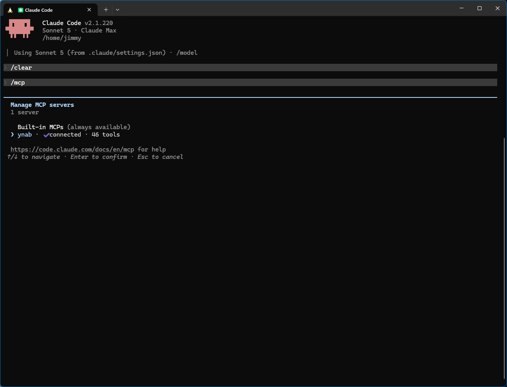
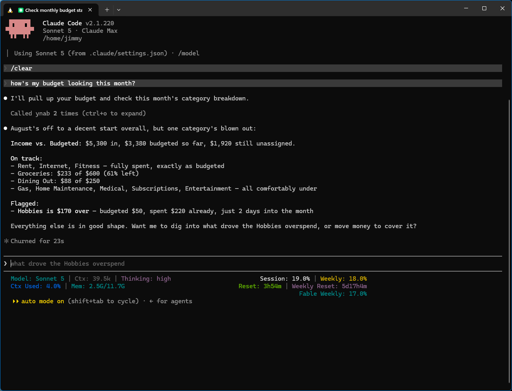

## Connect to a server (OAuth) — recommended

If someone — you, or someone in your household — is running the
[self-hosted server](/host-your-own/), this is the recommended way to connect: you log into YNAB
with your own account instead of sharing a token.

```bash
claude mcp add --transport http ynab https://<your-hostname>/mcp
```

Then, in a session, run `/mcp` → **Authenticate** to do the browser OAuth login — you'll log into
YNAB and choose read-only or full access. Re-run `/mcp` anytime to check status or re-authenticate.

## Alternate: stdio + Personal Access Token

No server to run, but a single token stands in for your own login — the right trade when you're
the only person using this.

```bash
claude mcp add --transport stdio \
  --env YNAB_TOKEN=your-personal-access-token \
  --env YNAB_BUDGET_ID=last-used \
  ynab -- npx -y @redlinelabs/ynab-mcp
```

Add `-s user` before `ynab` to make it available in every project instead of just the current one.
Env vars are scoped to the server process. See the [Quick start](/start-here/quick-start/) for
where to get a token.

## What it looks like

Both captures below are real sessions against [demo mode](/start-here/quick-start/) — a fictional
budget, no credentials.




