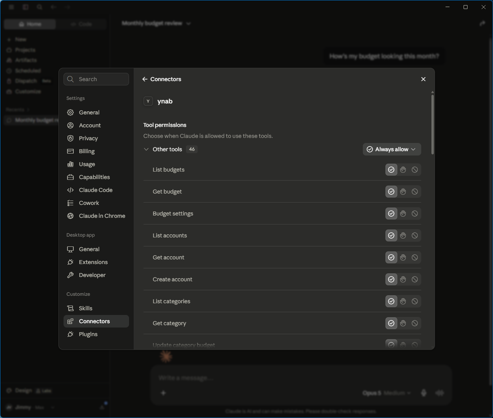
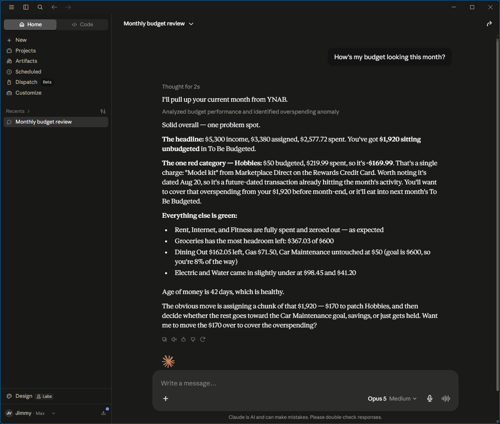

## Connect to a server (OAuth) — recommended

If someone — you, or someone in your household — is running the
[self-hosted server](/host-your-own/), this is the recommended way to connect: you log into YNAB
with your own account instead of sharing a token. **Settings → Connectors → Add custom
connector**, name it `YNAB`, and enter the server's URL (`https://<your-hostname>/mcp`). Claude
Desktop walks you through logging into YNAB and choosing read-only or full access; the connection
persists after that. (Needs a Claude Desktop build with custom-connector / remote-MCP support.)

## Alternate: stdio + Personal Access Token

No server to run, but a single token stands in for your own login — the right trade when you're
the only person using this. Edit Claude Desktop's config file —
`%APPDATA%\Claude\claude_desktop_config.json` on Windows,
`~/Library/Application Support/Claude/claude_desktop_config.json` on macOS — and add an entry
under `mcpServers`:

```json
{
  "mcpServers": {
    "ynab": {
      "command": "npx",
      "args": ["-y", "@redlinelabs/ynab-mcp"],
      "env": {
        "YNAB_TOKEN": "your-personal-access-token",
        "YNAB_BUDGET_ID": "last-used"
      }
    }
  }
}
```

Restart Claude Desktop. See the [Quick start](/start-here/quick-start/) for where to get a token,
and [Trust](/trust/) for what `YNAB_READ_ONLY` changes if you'd rather add it here too.

## What it looks like

Both captures below are real sessions against [demo mode](/start-here/quick-start/) — a fictional
budget, no credentials.




