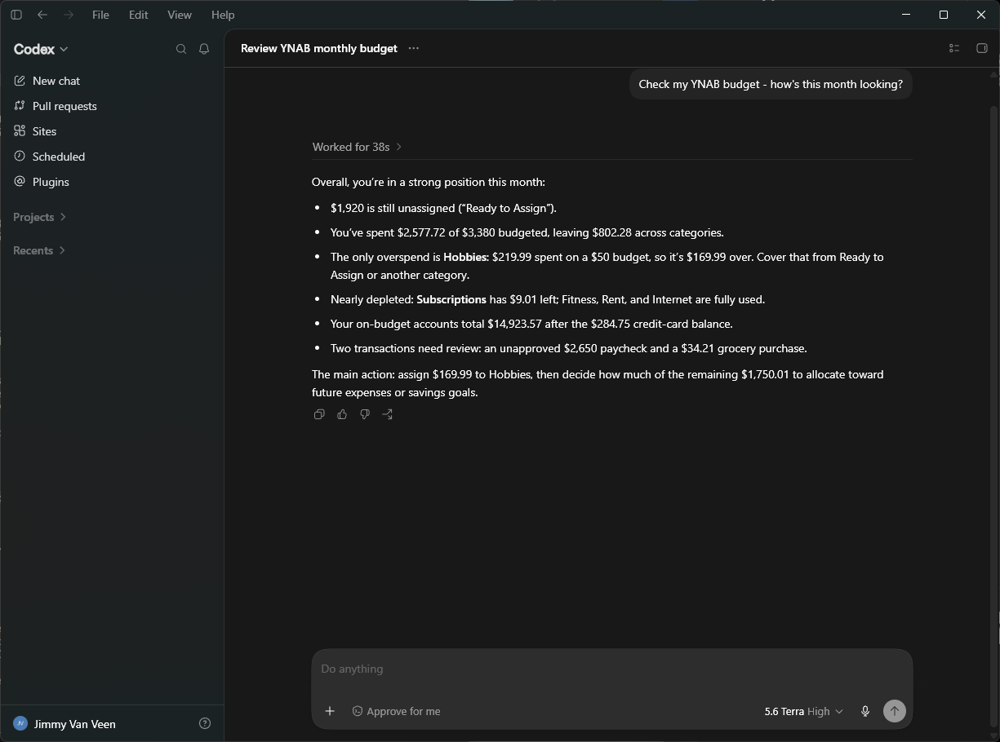

The Codex desktop app reads the same `~/.codex/config.toml` as [Codex CLI](/connect/codex-cli/) —
there's no separate app-specific config format, and configuring one surface configures the other.

## Connect to a server (OAuth) — recommended

If someone — you, or someone in your household — is running the
[self-hosted server](/host-your-own/), this is the recommended way to connect: you log into YNAB
with your own account instead of sharing a token. Add its URL instead of a command:

```toml
[mcp_servers.ynab]
url = "https://<your-hostname>/mcp"
```

The app's OAuth login for MCP servers runs through the same flow the CLI's `codex mcp login`
triggers — log into YNAB and choose read-only or full access when prompted. If the app doesn't
surface a login prompt automatically, run `codex mcp login ynab` from a terminal; both share the
same config and the same stored credentials.

## Alternate: stdio + Personal Access Token

No server to run, but a single token stands in for your own login — the right trade when you're
the only person using this. Add this to `~/.codex/config.toml` (by hand, or via `codex mcp add`
from a terminal — see the [Codex CLI page](/connect/codex-cli/) for that command):

```toml
[mcp_servers.ynab]
command = "npx"
args = ["-y", "@redlinelabs/ynab-mcp"]

[mcp_servers.ynab.env]
YNAB_TOKEN = "your-personal-access-token"
YNAB_BUDGET_ID = "last-used"
```

Restart the app. See the [Quick start](/start-here/quick-start/) for where to get a token.

## What it looks like

A real Codex app session against [demo mode](/start-here/quick-start/) — a fictional budget, no
credentials. Tip: naming YNAB in your prompt ("Check my YNAB budget…") is the reliable way to get
Codex to reach for the tools on the first try.


