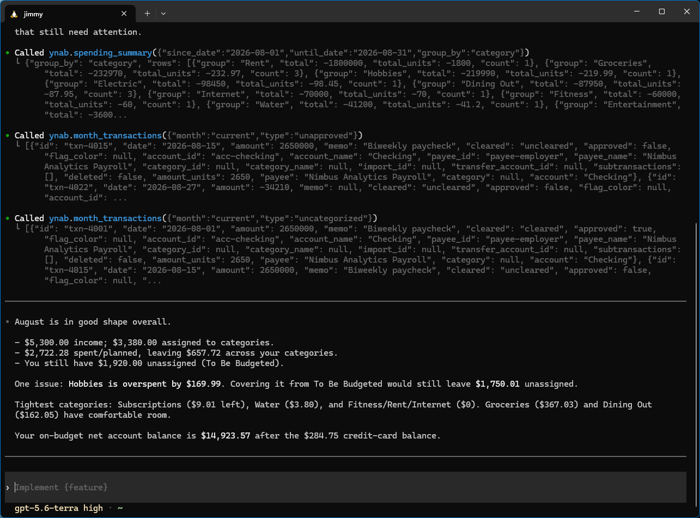

Codex stores MCP server config in `~/.codex/config.toml` (or a project-scoped `.codex/config.toml`
for trusted projects).

## Connect to a server (OAuth) — recommended

If someone — you, or someone in your household — is running the
[self-hosted server](/host-your-own/), this is the recommended way to connect: you log into YNAB
with your own account instead of sharing a token. Point Codex at its URL instead of a command:

```toml
[mcp_servers.ynab]
url = "https://<your-hostname>/mcp"
```

Then start the login:

```bash
codex mcp login ynab
```

This opens the browser OAuth flow — you'll log into YNAB and choose read-only or full access.

## Alternate: stdio + Personal Access Token

No server to run, but a single token stands in for your own login — the right trade when you're
the only person using this.

```bash
codex mcp add ynab \
  --env YNAB_TOKEN=your-personal-access-token \
  --env YNAB_BUDGET_ID=last-used \
  -- npx -y @redlinelabs/ynab-mcp
```

Or add it to `config.toml` directly:

```toml
[mcp_servers.ynab]
command = "npx"
args = ["-y", "@redlinelabs/ynab-mcp"]

[mcp_servers.ynab.env]
YNAB_TOKEN = "your-personal-access-token"
YNAB_BUDGET_ID = "last-used"
```

See the [Quick start](/start-here/quick-start/) for where to get a token.

## What it looks like

A real Codex CLI session against [demo mode](/start-here/quick-start/) — a fictional budget, no
credentials. The raw tool responses are visible, including the milliunit amounts and their
`*_units` siblings.


